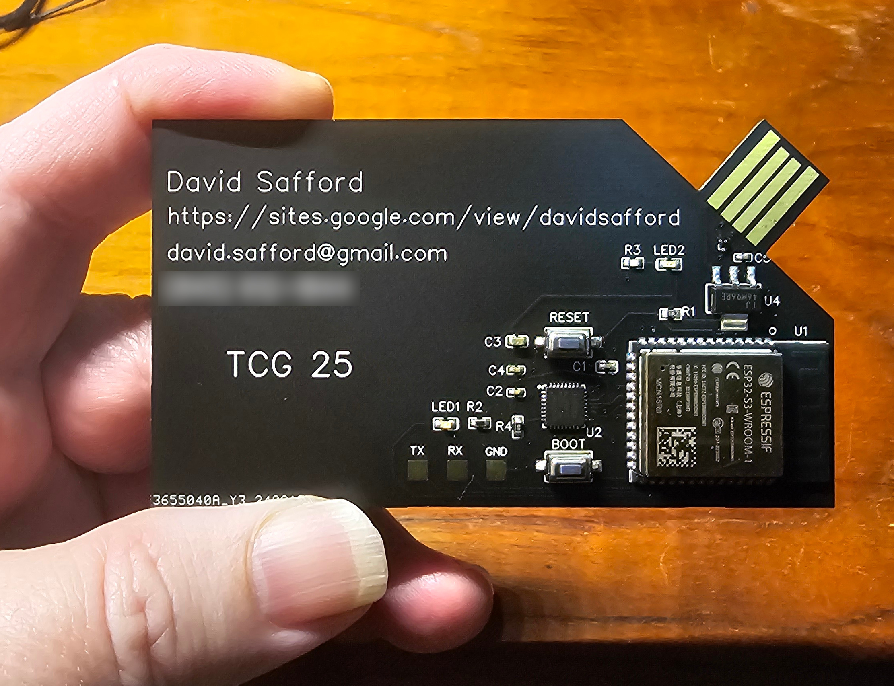

## **Trusted Business Card (TBC) README**

#### What is TBC?

The TBC project started as a fun response to George Hilliard's delightful project of making a business card that runs Linux.
(https://www.thirtythreeforty.net/posts/2019/12/my-business-card-runs-linux/)
His goal was to demonstrate his hardware and Linux skills in a fun way.

With the recent 25th aniversary of the Trusted Computing Group, I thought it would be fun to do a similar card but with an added Trusted Platform Module (TPM) to demonstrate my hardware and trusted computing skills. Then some pagers started
exploding, and the project redirected a bit to make it the smallest, cheapest, and
most simple demonstration of how trusted computing can help defeat many supply chain attacks, even in the low cost consumer electronics market.

So it's both Silly, and Not So Silly.

The card demonstrates several security features including:

- secure boot*.  
- platform authenticity based on endorsement and platform certificates.   
- measuremant and attestation of contents with a certified attestation key.  
- a digitally signed photo image of the original board for visual verification.  
- and, of course, my digitally signed resume.

*secure boot is not turned on initially, so you can play with the card, and so that you can enable secure boot with your own keys, as described in section 5, below.

Additional details of the card with pretty pictures are provided in the TBC.odp set of slides in "docs".

#### **Verifying a TBC - a 5 Minute Quickstart Guide**

If you have one of the cards I gave out at the 25th member's meeting, or the
February 2025 Member's meeting here's how to verify it. The instructions are 
tested on Fedora 40, although all tools are fairly portable, and should run on 
most Linux systems.

Install TCG's fork of openssl in /usr/local:

     git clone -b pcv2 https://github.com/TrustedComputingGroup/openssl.git
     cd openssl
     ./Configure
     make
     sudo make install

 To use this version of ssl make sure your path has /usr/local/bin first, and use /usr/local/lib64 with:

```
     export LD_LIBRARY_PATH=/usr/local/lib64
```

(By default your path should be correct, and the tbc scripts modify the library path for you.)

Clone the tbc repo

    git clone https://github.com/safforddr/tbc.git

If you are not running Fedora 40, you will probably need to rebuild the tools in tbc.

     cd tbc/tools
     make clean
     make

Insert the card. It should appear as a removeable drive, with files visible in Gnome Files.

Run a verification:

    cd tbc
    ./tbc_verify.sh

This will produce a summary report of the verification.
Note that the first verification will not have a fresh challenge.
Simply reset the card (with its "reset" button), and rerun tbc_verify.sh.
To get a detailed report run

    ./tbc_verify.sh --verbose

This adds detailed dumps of the EK and Platform certs, the Quote, and Event Log.

View CARD.JPG in Files. This is a photograph of a known good card, and you can compare your card to the image to check for any hardware tampering. Of course, then you should view my resume (safford.pdf).

If you want a GUI view of all of the certificates and their chains, you can run HIRS in a container:

    podman run --name=aca -p 8443:8443 ghcr.io/nsacyber/hirs/aca:latest

then point your browser to https://localhost:8443
You can then load the CA certs from tbc/certs, and the card certs (EK.CRT and PLATFORM.CRT) from the card. HIRS can display the certs in detail, with verification of the certificate chain. If you are not familiar with podman, useful commands are:

    podman stop aca
    podman start aca  (only use "podman run" the first time).

#### **Making your own TBC - Hardware**

tbc/hw/card3 is an EasyEDA offline project directory for the card.
You can download EasyEDA from https://image.easyeda.com/files/easyeda-linux-x64-6.5.46.zip  Unzip this file, cd into the resultand directory, and run install.sh (as root).
Copy the tbc/hw/card3 directory into ~/.easyeda/projects, and it should show up in EasyEDA.  You will want to edit the silkscreen layer to add your information, and then export the gerbers and upload them to jlcpcb.com.

I used the defaults (FR-4, 2 layer, 1.6 mm), but selected options for ENIG with 2U gold, so that the usb pads would be reasonably durable. USB requires a board slightly thicker than 1.6mm. I used some 0.02" PET/Plexiglass Sheet material glued to the back of the usb connection part of the board to make it the right thickness. I also ordered the paste stencil from jlcpcb, as it makes the assembly much easier.

I ordered the parts from Digikey. Here's my BOM:

| Schematic ID | Manufacturer ID        | Digikey ID                       | Description     |
| ------------ | ---------------------- | -------------------------------- |:--------------- |
| U1           | ESP32-S3-WROOM-1-N16R8 | 1965-ESP32-S3-WROOM-1-N16R8CT-ND | ESP32S3         |
| U2           | SLB9672AU20FW1613XTMA1 | 448-SLB9672AU 20FW1613XTMA1CT-ND | TPM             |
| D1           | TPD2EUSB30ADRTR        | 296-28153-1-ND                   | ESD Diodes      |
| U4           | TLV1117LV33DCYR        | 296-28778-1-ND                   | 3.3V regulator  |
| Led1, Led2   | QTLP601CRTR            | 1080-1407-1-ND                   | Led, Red        |
| Boot, Reset  | RS-282G05A3-SMRT       | CKN10384CT-ND                    | Switch, Tactile |
| R1, R4       | RMCF0603JT10K0         | RMCF0603JT10K0CT-ND              | Res 10K         |
| R2, R3       | ERJ-3EKF2001V          | P2.00KHCT-ND                     | Res 2K          |
| C1           | CL05A105KP5NNNC        | 1276-1076-1-ND                   | Cap Cer 1uf     |
| C2, C4, C5   | CL05B104KA5NNNC        | 276-6720-1-ND                    | Cap Cer 0.1uf   |
| C3           | CL10A226MQ8NRNC        | 1276-1193-1-ND                   | Cap Cer 22uf    |

For assembly, I used leaded solder paste applied through the stencil, and manual placement with really tiny tweezers and an 80 JL210 10.1" Digital Microscope. I used a $50 BLACK+DECKER 4-Slice Toaster Oven, TO1745SSG for reflow soldering. Pretty much any of their small 3 knob models will work. The thermostat is amazingly accurate. I put the board in the metal tray with a foil tent on top to prevent direct infrared from burning the card. I set the thermostat for 400F, turned it on,waited until it hit 400F (the thermostat will click. and the elements will turn off), and then waited an additional 50 seconds with the oven off, before opening the door all the way for cool down.  That's it. With a little practice spreading the paste (not too much, not too little), and careful placement, the cards turned out perfectly every time.

#### **Making your own TBC - Firmware**

Arduino 5 minute Quickstart

    download appimage from 
        https://downloads.arduino.cc/arduino-ide/arduino-ide_2.3.3_Linux_64bit.AppImage
    chmod 755 arduino-ide_2.3.3_Linux_64bit.AppImage
    dnf install python3-pyserial
    ./arduino-ide_2.3.3_Linux_64bit.AppImage
    select "Esp32s3 Dev Module" (use board manager to load the esp32 package if needed).

Espressif esp-idf development:
The esp-idf deveelopment tool set is needed for building the full card application,
particularly for wolfTPM, tinyusb, and secure boot support. The tbc/fw directory has esp-idf source files for the full card firmware.  This requires installation of esp-idf, wolfSSL and wolfTPM.  Once these are installed, copy the tbc/fw files to overwrite the originals in wolfTPM/IDE/Espressif.  The firmware sources are now tested with esp-idf version 5.4.

See https://docs.espressif.com/projects/esp-idf/en/stable/esp32/gt-started/linux-macos-setup.html
for detailed installation instructions for esp-idf. Note that the current wolfTPM does not have a HAL driver for the SLB9672 (SPI) TPM. One is provided in this repo's fw/HAL/tpm_io_espressif.c file which replaces the same named file in wolfTPM's "hal" directory.

TYpical command sequence

    . ~/esp/esp-idf/export.sh
    cd ~/esp/wolfTPM/IDE/Espressif
    idf.py set-target esp32s3   
    idf.py menuconfig
           (enable tinyusb with MSC and CDC, and enable custom partition - "partitions.csv")
    idf.py build
    idf.py -p /dev/ttyACM0 flash monitor
         Note: to enable programming mode, press and hold "boot", press and release 
             "Reset", release "boot"
         Note: if secure boot is enabled, programming is only possible with through the 
             TX/RX/GND pins.

#### **Certifying your own TBC**

Install paccor: Download 

https://github.com/nsacyber/paccor/releases/download/v1.1.4r11/paccor-1.1.4-11.noarch.rpm

and  then

    sudo dnf install ./paccor-1.1.4-11.noarch.rpm

The command 

```
`tbc_certify.sh board_number device (e.g. /dev/sda1)`
```

Will certify a new board, creating and installing all the needed certificates.
Note that you will want to change the O and DN and filename defines in the scripts, 
in tools/gencert.c, and in the json files for platform cert creation.

#### **Turning on Secure boot**

First, you have to have the esp-idf development environment installed as in 3 above.

In general, follow "How To Enable Secure Boot V2" in "ESP32-S3 ESP-IDF Programming Guide".

https://docs.espressif.com/projects/esp-idf/en/v5.3.1/esp32s3/esp-idf-en-v5.3.1-esp32s3.pdf

Some tips:
Use idf.py menuconfig to change partition table offset from 0x8000 to 0xa000,
turn on secure boot, and set the path to the private key you want to use.

I.E. in idf.py menuconfig:

    "Security Features":
        "Enable hardware Secure Boot in bootloader"
        "(private.pem) Secure boot private signing key"
    "Partition Table":
        "(0xa000) Offset of partition table"

Before building the bootloader, generate the private key with:

    espsecure.py generate_signing_key --version 2 private.pem

Build the bootloader with:

    idf.py bootloader

Write the bootloader with    

    esptool.py write_flash 0x0 build/bootloader/bootloader.bin

Build and flash the application with

    idf.py -p /dev/ttyACM0 flash monitor

This will turn on secure boot and write the key hash into efuse.
From then on, the card can still be programmed, but only with a signed
application, and only over the hardware UART (the RX/TX/GND pads on the card.)
You will need a usb to uart cable with 3.3v setting. You can connect this
temporarily with pogo pins, or you can solder an L header to the pads.
